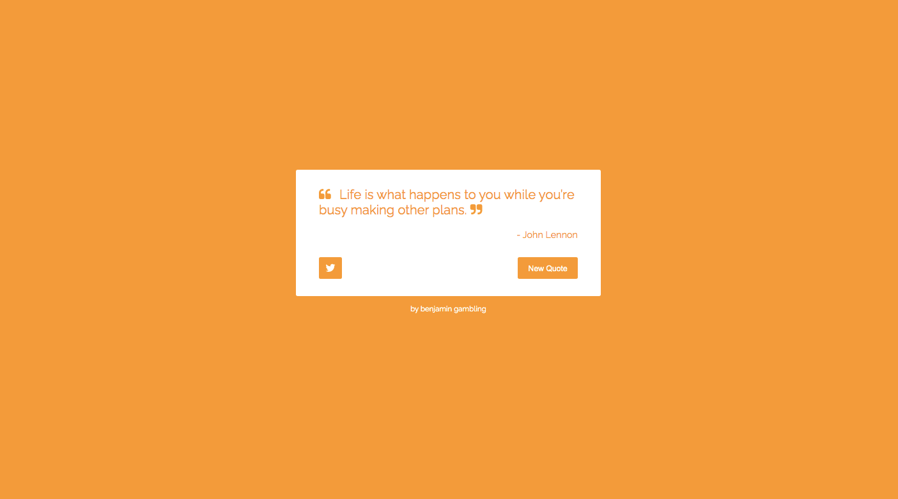

# Random Quote Machine

This project was completed as part of the Free Code Camps Front End Libraries Assignment.

This project was created using React and bootstrapped with [Create React App](https://github.com/facebook/create-react-app).

The aim of the project was to create an random quote machine using react and work with the features that React presents. This was done by fetching data from a JSON file and then using state to update all the inforamtion either on a timer or when the user clicks.

# 

## Table of contents

1. [Demo](#demo)
2. [Technologies](#technologies)
3. [Features](#features)
4. [Development](#development)
5. [License](#license)

## Demo

Here is the working live demo:
[https://benjamin-gambling.github.io/random-quote-machine/](https://benjamin-gambling.github.io/random-quote-machine/).

## Technologies

- [ReactJS](https://reactjs.org/)

  

## Features

- Randomly picks a quote to display by fetching from a JSON file
- Changes color when new quote is displayed
- Tweet quote
- Timer or Click to display new quote
- Using React to make rerendering effiecnt

### Devlopment

- Mobile Friendly
- User subscribe and recives new quotes daily
- Increase quote list
- Bow shadow to create 3D effect

## License

> You can check out the full license [here](LICENSE)

This project is licensed under the terms of the **MIT** license.
